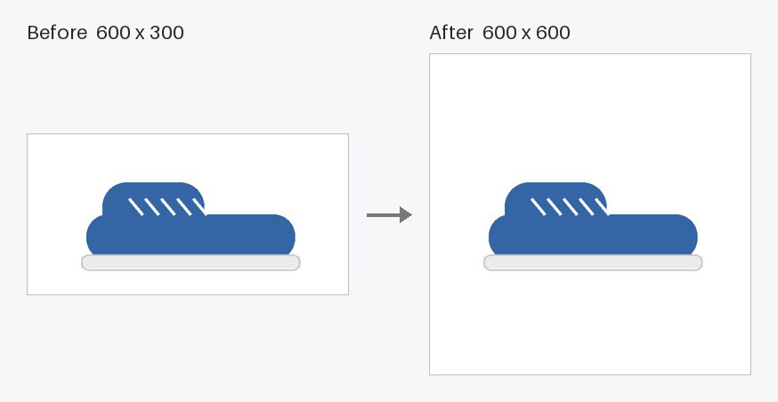

# Image Square Converter

[](https://github.com/julianmarinov/Image_Square_Converter_GUI/actions/workflows/python-package.yml)

[](LICENSE)

A small desktop app that turns a whole folder of rectangular images into square ones by padding them with white space. Nothing is cropped or stretched.

It's made for e-commerce product photos, marketplace listings and anywhere else that needs uniform square images. On a 2015 MacBook Pro it converted 3,300+ images in about 40 seconds.



## Features

- **Batch conversion.** Pick a folder and every `.png`, `.jpg`, `.jpeg` and `.gif` inside it is converted, including subfolders.
- **Keeps your folder structure.** Subfolders are mirrored in the export folder, so files with the same name never overwrite each other.
- **Clean results.**
  - Transparent areas become white.
  - Phone photos keep their correct orientation.
  - JPEGs are saved at high quality with their color profile intact.
- **Safe by default.**
  - Your originals are never modified.
  - Choosing the same folder for import and export is blocked.
- **Handles problem files.** Broken or unreadable images are skipped and listed in a summary instead of stopping the batch.
- **Responsive window.** A live progress bar shows how far along the conversion is, and you can close the app at any time.

## Download

A ready-to-run app for **Macs with Apple Silicon** (M1 or newer) is attached to the latest release on the [Releases page](https://github.com/julianmarinov/Image_Square_Converter_GUI/releases). Unzip it and move **Image Square Converter.app** to Applications.

The app isn't signed with an Apple Developer ID, so macOS blocks it the first time you open it. To allow it:

1. Try to open the app, then close the warning.
2. Go to **System Settings → Privacy & Security**, scroll down and click **Open Anyway** next to the message about Image Square Converter.
3. Confirm with **Open Anyway** again.

On an Intel Mac, Windows or Linux, [run it from source](#run-from-source) or [build the app yourself](#build-the-macos-app).

## Run from source

Requires Python 3.9 or newer with Tkinter. Tkinter is included with the python.org installers; with Homebrew, run `brew install python-tk`.

```bash
git clone https://github.com/julianmarinov/Image_Square_Converter_GUI.git
cd Image_Square_Converter_GUI
python3 -m venv venv
venv/bin/pip install -r requirements.txt
venv/bin/python main.py
```

On Windows, use `venv\Scripts\pip` and `venv\Scripts\python` instead.

## Usage

1. Click **Browse** next to **Import Path** and choose the folder with your images.
2. Click **Browse** next to **Export Path** and choose where the square images should go.
3. Click **Convert to Square** and wait for the summary.

## Build the macOS app

To make a double-clickable app, for example on an Intel Mac, set things up as in [Run from source](#run-from-source) and then run:

```bash
venv/bin/pip install pyinstaller
venv/bin/pyinstaller main.spec
```

You'll find **Image Square Converter.app** in the `dist` folder. It runs on the same type of Mac it was built on: Intel or Apple Silicon.

## Development

```bash
venv/bin/pip install pytest flake8
venv/bin/pytest
```

- `square_converter.py` holds the image logic and doesn't depend on Tkinter.
- `main.py` is the GUI.
- Tests live in `tests/` and run on GitHub Actions for Python 3.9–3.12.

## License

[MIT](LICENSE) © Julian Marinov
